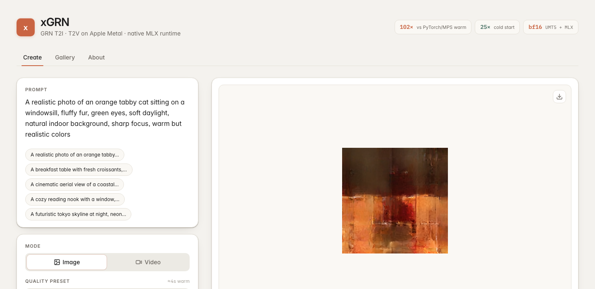
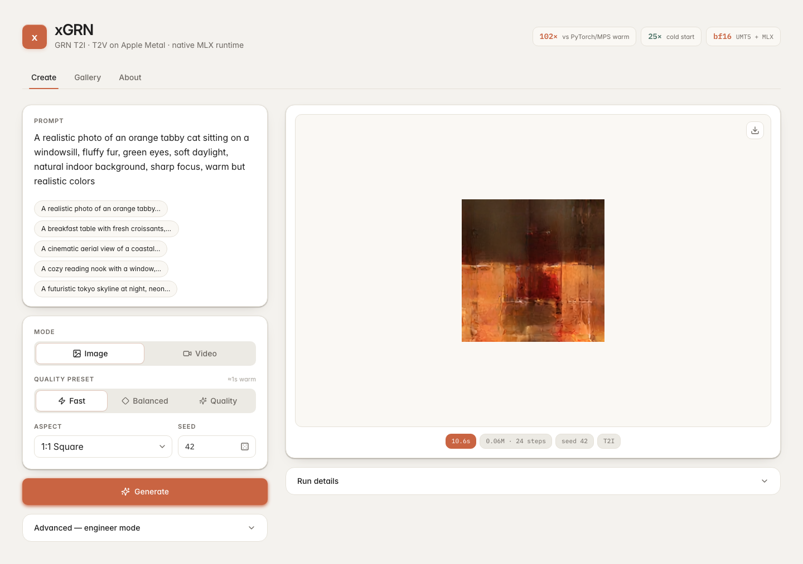

# xGRN — GRN on Apple Metal, fast

> **102x faster** than stock PyTorch/MPS (warm, debug profile) · **25x faster** cold start · native MLX + Metal

<p align="center">
  
</p>

Mac-specialized runtime for the official GRN T2I/T2V models. The GRN transformer
and refinement loop run in MLX. Prompt embeddings are cached as MLX-readable
artifacts after the first UMT5 run. HBQ decode uses a native MLX decoder by
default, with the official PyTorch/MPS decoder kept as a fallback.

## TL;DR — one command

```bash
uv run xgrn-app
```

First launch downloads the official GRN weights from HuggingFace, converts them
to MLX artifacts, then opens the UI on <http://127.0.0.1:7860>. Subsequent
launches reuse the cache and start in seconds.

The UI hides every dtype / kernel-fusion / sampling knob behind an **Advanced**
panel — pick a prompt, pick **Image** or **Video**, pick a **Quality** preset
(Fast ≈ 1 s · Balanced ≈ 4 s · Quality ≈ 12 s, warm), hit **Generate**.

<p align="center">
  
</p>

## Speed at a glance

| | PyTorch/MPS fp32 | xGRN MLX bf16 (cold) | xGRN MLX bf16 (warm) |
|---|---:|---:|---:|
| `debug` 0.06M, 2 steps | 109.19 s | **4.39 s** | **1.07 s** |
| Speedup vs PyTorch | — | **25×** | **102×** |

Full benchmark table in [Performance](#performance).

## Quickstart

### Install

```bash
uv sync --python 3.11
```

xGRN reuses the official GRN text encoder implementation, so the official
source checkout must sit beside this repo:

```bash
cd ..
git clone https://github.com/MGenAI/GRN GRN
cd xGRN
```

### Start

```bash
uv run xgrn-app
```

Open <http://127.0.0.1:7860>. If the port is busy, use another one:

```bash
uv run xgrn-app --server-port 7861
```

### First Use

On first startup, `xgrn-app` checks `models/GRN`. If the required weights are
missing, it downloads the official HuggingFace snapshot with progress, retries a
failed download once, then creates the MLX artifacts used by the app. Existing
files are reused, so later launches skip the download and conversion.
The full T2I+T2V cache is large; keep enough free disk for the raw HuggingFace
snapshot plus MLX `fp16`/`fp32` artifacts.

T2I and T2V weights are prepared by default. The cache location, model id, and
revision are configurable:

```bash
XGRN_MODEL_DIR=/Volumes/ssd/xgrn/GRN \
XGRN_HF_REPO_ID=bytedance-research/GRN \
XGRN_HF_REVISION=main \
uv run xgrn-app --server-port 7861
```

Set `XGRN_AUTO_DOWNLOAD=0` or pass `--no-auto-download` when you want startup to
fail fast with a repair command instead of downloading.

Manual prefetch is optional, but useful before a demo or on a slow network:

```bash
uv run xgrn-download --model-dir models/GRN
uv run xgrn-run --task T2I
uv run xgrn-validate outputs/latest_t2i.png
```

If startup is blocked, the error prints the missing files and the exact command
to repair the cache.

## Outputs

| File | Description |
|---|---|
| `outputs/latest_t2i.png` | Most recent T2I result |
| `outputs/latest_t2v.mp4` | Most recent T2V result |
| `outputs/latest_refinement.gif` | Per-step frames (when capture enabled) |
| `outputs/refinement_stats.csv` | Per-step timing stats |

## Defaults

| Setting | Value |
|---|---|
| Token budget | `0.25M` (correctness gate) |
| Refinement steps | 50 |
| Temperature | 1.1 |
| Text encoding | bf16 UMT5 |
| Prompt embedding cache | fp32 |
| GRN matmul compute | bf16 |
| Visual pass | fixed-shape compiled CFG |
| HBQ decoder | native MLX |

`0.06M` is available as a fast debug preset but is not accepted as the semantic
correctness gate. The runtime supports higher step counts (150, 250); latency
scales roughly linearly.

**Prompt cache:** the first run for a new prompt builds the embedding cache.
Subsequent runs with the same prompt skip that cost entirely. Benchmark rows
report `end_to_end_sec` as the primary metric (includes generation, decode,
output writing, and validation). `generation_wall_sec` is kept as a no-validation
comparison point.

**Warm benchmarks:** use `--warmup --repeat 5` for full warm-run timing. For
long profiles, `--stable-shape-warmup` warms the same MLX graph, KV cache, GRN
weights, and decoder weights with two refinement steps before measuring the real
profile.

**Low-memory cleanup:** `xgrn-run` and `xgrn-bench` support
`--release-after-run`; add `--release-text-cache` to also clear in-process prompt
embedding arrays. This trades away repeated-prompt warm-cache speed for lower
post-run memory pressure.

**Validation artifact:**

```bash
uv run xgrn-validate outputs/orange_tabby_50steps_seed42_pn025M_bf16text.png
```

## Performance

All timings are strict end-to-end wall time. Rows with validation include CLIP
time in `end_to_end_sec`.

| Profile | Runtime | Command | End-to-end | GRN refine | Decode | Max RSS | Notes |
|---|---|---|---:|---:|---:|---:|---|
| `debug` (0.06M, 2 steps) | PyTorch/MPS fp16 (historical baseline, code removed) | — | failed | failed | failed | n/a | MPS matmul dtype assertion |
| `debug` (0.06M, 2 steps) | PyTorch/MPS fp32 (historical baseline, code removed) | — | 109.19 s | n/a | n/a | 19.37 GB | one-shot reference; `xgrn_metal/bench_pytorch.py` retired |
| `debug` (0.06M, 2 steps) | **xGRN MLX bf16 + native HBQ cold** | `uv run xgrn-bench --profile debug` | **4.39 s** | 3.81 s | 0.56 s | 9.91 GB | `outputs/bench/debug-native-decoder-bf16-cold-report.json` |
| `debug` (0.06M, 2 steps) | **xGRN MLX bf16 + compiled visual + native HBQ warm median** | `uv run xgrn-bench --profile debug --warmup --repeat 5` | **1.07 s** | 0.78 s | 0.28 s | 9.91 GB | `outputs/bench/debug-compile-visual-pass-warm-repeat5-report.json` |
| `debug` (0.06M, 2 steps) | xGRN MLX bf16 + native HBQ warm, no visual compile | `uv run xgrn-bench --profile debug --no-compile-visual-pass --warmup --repeat 5` | 1.18 s | 0.86 s | 0.31 s | 8.36 GB | fallback comparison |
| `debug` (0.06M, 2 steps) | xGRN MLX fp32 + MPS HBQ warm median | `uv run xgrn-bench --profile debug --compute-dtype fp32 --decoder-backend mps --warmup --repeat 5` | 1.80 s | 0.92 s | 0.87 s | 13.97 GB | old fallback comparison |
| `t2i-correct` (0.25M, 50 steps) | xGRN MLX bf16 + MPS HBQ + CLIP | `uv run xgrn-bench --profile t2i-correct --decoder-backend mps` | 103.67 s | 89.24 s | 8.13 s | 13.73 GB | CLIP score 0.9618 |
| `t2i-correct` (0.25M, 50 steps) | **xGRN MLX bf16 + compiled visual + native HBQ + CLIP warm median** | `uv run xgrn-bench --profile t2i-correct --stable-shape-warmup --repeat 5` | **80.90 s** | 77.70 s | 1.17 s | 9.90 GB | CLIP 5/5, score 0.9634 |
| `t2i-correct` (0.25M, 50 steps) | low-memory fp16 weights + bf16 compute + native HBQ + CLIP | `uv run xgrn-bench --profile t2i-correct --weights-dtype fp16` | 89.87 s | 82.47 s | 1.27 s | 6.31 GB | CLIP score 0.7247 |
| `t2i-step-stress` (0.06M, 150 steps) | xGRN MLX bf16 + compiled visual + native HBQ + CLIP | `uv run xgrn-bench --profile t2i-step-stress --stable-shape-warmup` | 67.04 s | 59.87 s | 0.31 s | 10.48 GB | CLIP failed, score 0.0010 |
| `t2v-short` (0.06M, 16 steps) | xGRN MLX bf16 + compiled visual + native HBQ | `uv run xgrn-bench --profile t2v-short` | 17.15 s | 15.85 s | 1.14 s | 9.95 GB | `outputs/bench/t2v-short-default-compile-visual-bf16-native-report.json` |

For the `debug` profile: **24.9× faster cold start** and **102.3× faster warm**
vs original PyTorch/MPS fp32.

### Where time goes at `0.25M / 50 steps`

Per-step GRN ≈ **1.55 s** (77.70 s / 50). 28 transformer blocks × CFG-batched
visual pass + sampling/mask update fire ≈ 200 Metal kernel dispatches per step.
GPU utilization ≈ 6 %. The dominant cost on M4 Pro is command-buffer submission
overhead (~50–150 µs per dispatch), not raw compute or HBM bandwidth.

That single fact decides what we try next:

| Track | What | Expected | Status |
|---|---|---:|---|
| A1-lite | Custom `mx.fast.metal_kernel`: fused `apply_rope` (one kernel replaces 7 elementwise dispatches per Q/K rotation) | -1.63% wall on `t2i-correct`, CLIP variance shift; **shipped opt-in** via `--fuse-rope-metal` |
| A1-full | Fused `rmsnorm + q_proj` (POC, naive scalar matmul) | **POC: 8× slower than MLX matmul in microbench** (9.4 ms vs 1.2 ms per call). Parity perfect (fp32 max-abs-diff 2.86e-6) but naive matmul cannot beat Apple's tuned GEMM. Function kept as scaffolding; not wired into block. Real win requires `simdgroup_matrix_storage` 8×8×8 multiplies (multi-day project). |
| A2 | Custom Metal: fused `x + attn` and post-attn `rms_norm` (multi-output threadgroup-reduce kernel) | **measured: -0.28% GRN, +7% RSS** — flag landed but **stays opt-in only**, kernel kept as template for A3 / A1-full |
| A3 | Custom Metal: fused sampling + mask update with `atomic_outputs` | ~5–10 ms/step expected — **deferred** (per dispatch-count theory, in noise floor; not worth the kernel work) |
| B | Whole-stack `mx.compile(shapeless=True)` across all 28 blocks | cross-block fusion | active, codex tmux |
| C | Late-step-only CFG (`--cfg-start-step K`, skip uncond before step K) | 13.8 % wall at K=15 on the standard prompt | shipped opt-in, K=0 default, see Experiment Outcomes |
| D | Step distillation (DiMO / CDLM) → 8–12 steps | 3–10× | future training |

Aggregate ceiling on the kernel-fusion tracks alone: dispatches **200 → ~70**,
GRN per-step **1.55 s → ~1.0 s**, `0.25M/50` end-to-end **80.90 s → ~55 s**.
Every track must keep `xgrn-parity --full-step` exact and CLIP positive
`>= 0.93`. See `PERFORMANCE_PLAN.md` for the full rules and `CODEX_TASKS.md`
for the active task briefs.

### Experiment Outcomes

| Experiment | Result |
|---|---|
| Per-block `mx.compile` | regressed debug warm to 1.97 s |
| `mx.async_eval` in refinement loop | regressed debug warm to 2.34 s |
| `--compile-cfg-logits` | passed CLIP at 90.03 s / 8.87 GB RSS, but slower than default |
| `--compile-refinement-update` | fixed-shape compiled sampling/mask update regressed debug warm to 1.10 s |
| `--sampling-mode argmax` | debug warm median 1.09 s, not faster than stochastic categorical; kept for debug only |
| `--sampling-mode binary` | Bernoulli sampler for the fixed two-class logits; debug warm repeat-3 regressed to 1.13 s |
| `--linear-quantization int8` | passed CLIP but slowed `0.25M/50` to 105.42 s; not useful vs fp16 weights |
| `--linear-quantization int4` | debug warm median 1.09 s, no speed or RSS win |
| `--weights-dtype fp16` | passed CLIP at 89.87 s / 6.31 GB RSS, lower semantic margin; kept as low-memory mode |
| `--text-dtype fp16 --text-cache-dtype fp16` | loose validator passed, but strict CLIP gate missed (`0.8493 < 0.93`) and GRN slowed to 86.33 s |
| `--mask-schedule dus` | 20/30/40 steps were faster but failed CLIP; 40 steps reached only 0.3683 positive score |
| no-upcast RMSNorm experiment | regressed the default debug gate; fp32 `mx.fast.rms_norm` remains default |
| `--precompute-pt-embed` | debug warm repeat-3 regressed to 1.09 s; default remains on-demand |
| `--fuse-swiglu-metal` | numeric diff `2.38e-7`, but debug warm repeat-3 regressed to 1.11 s |
| `--fuse-rope-metal` (Track A1) | Fuses the 7-dispatch `apply_rope` into one Metal kernel. fp32 max-abs-diff `2.38e-7` vs `apply_rope`. Debug warm repeat-5 GRN median `0.772 → 0.763 s` (-1.17%). `t2i-correct` warm repeat-3 end-to-end `76.66 → 75.41 s` (-1.63%), CLIP positive `0.9904 → 0.8985`. The CLIP drop is the expected numerical-equivalent sample shift (fp32 rounding propagated through 50 stochastic refinement steps). Loose validator still passes 3/3; strict 0.93 gate missed by 0.03. Ship as opt-in only. |
| `--fuse-residual-norm-metal` (Track A2) | Fuses `x + attn` and the post-attn `rms_norm` into one Metal kernel per block (multi-output, threadgroup reduction over hidden_dim=2304). fp32 max-abs-diff `9.54e-7` on both residual and normed outputs. **Measured negative result.** `t2i-correct` warm repeat-3 GRN `75.56 → 75.35 s` (-0.28%), end-to-end `76.66 → 76.55 s` (-0.15%), **RSS `+7.09 %` (+684 MB)** because the kernel's two output buffers cannot be freed in-place the way MLX's compile manages the residual reuse. CLIP `0.9904 → 0.9393`. A2 saves 12× fewer dispatches per step than A1 (28 vs 336), so the proportionally smaller speedup matches the dispatch-count theory cleanly — but the RSS cost makes it a bad default at this point. Flag kept off by default; do not enable. Useful as a template for future multi-output fused kernels (A3, A1-full). |
| `fused_norm_qproj` (Track A1-full POC) | Fused `rms_norm(x) @ q_proj_weight` Metal kernel. One threadgroup per token, ssq reduction → normed-x in threadgroup memory → naive scalar dot-products for output columns. Parity vs reference at fp32 noise floor (max-abs-diff 2.86e-6). **Microbench: 9.4 ms / call, vs 1.2 ms / call for MLX's `rms_norm + matmul` = 8× slower.** Not wired into the block — naive scalar matmul cannot beat Apple's tuned GEMM. The kernel is kept as scaffolding for a future `simdgroup_matrix_storage` 8×8×8 rewrite that would close the matmul gap; that's a multi-day project, out of session scope. |
| `simdgroup_matmul` (Track A1-full real foundation) | Module `xgrn_mlx/simdgroup_matmul.py` with byte-exact `simdgroup_matrix<float,8,8>` and `simdgroup_matrix<bfloat,8,8>` GEMMs that **match or beat MLX's tuned matmul on M4 Pro**. Winner layout: 2×2 simdgroup per threadgroup + 2×4 register tile per simdgroup (8 accumulators each). Microbench at the QKV shape (M=544, K=2304, N=2304): fp32 **1.045× of MLX matmul** (1235 µs vs 1182 µs), **bf16 0.975× of MLX bf16 matmul (1032 µs vs 1059 µs — 2.5% FASTER than MLX)**. Iteration log: 1-simdgroup-per-tile 4.39× → 2×2 simdgroup 2.13× → 2 acc/sg 1.82× → 4 acc (2×2 reg) 1.34× → **8 acc (2×4 reg) 1.05×**. 4×3 (12 acc) and 4×4 (16 acc) register tiles regressed (6.32×, 5.65×) because of register spill. The `simd_async_copy` path requires Metal 3's `simdgroup_event` header not present in MLX's current toolchain; deferred. |
| `--fuse-qkv-metal` (Track A1-full M3+M5 integration) | Routes q/k/v projection matmuls in `qkv()` through `simdgroup_matmul_bf16`. Smoke test on debug 4-step generation succeeded; debug warm repeat-5 GRN -0.52 % (small but consistent). **But t2i-correct strict gate regressed badly under both compile modes**: with `--compile-visual-pass` (default): GRN `75.56 → 79.57 s` (+5.31 %), end-to-end +8.86 %, **decode `1.06 → 1.99 s` (+88 %)**, CLIP `0.9904 → 0.9206`. With `--no-compile-visual-pass`: GRN +40.71 %, end-to-end +48.40 %, **decode +93.09 %**, CLIP unchanged. The decode regression persists with and without compile — so it is not a compile-graph issue. The `mx.fast.metal_kernel` output buffers / scheduling interact badly with subsequent GPU work in a way MLX's native matmul does not. The simdgroup matmul kernel itself remains a competitive primitive in `xgrn_mlx/simdgroup_matmul.py` (1.05× fp32, 0.975× bf16 vs MLX in isolation). Real integration likely requires writing the kernel as an MLX C++ extension so it is a first-class primitive in the compile graph and buffer-pool. Flag landed but **stays opt-in only**, default OFF, do not enable. |
| `--fuse-qkv-concat` (Track A1-full M3 alt, MLX-only) | Same QKV-fusion concept but uses **MLX's native matmul** against a precomputed concatenated `[q\|k\|v]` weight per block — no custom Metal kernel at all. Tests whether the M3 regression was a Metal-kernel issue or a fusion-shape issue. Isolated microbench showed -0.6 % on single fused matmul vs 3 separate. **t2i-correct verdict: also a regression**: GRN `75.56 → 79.15 s` (+4.75 %), end-to-end +5.32 %, decode +10.63 % (smaller than `--fuse-qkv-metal` but still positive), CLIP `0.9904 → 0.8999`. **The mx.compile'd visual pass already optimizes the 3 separate QKV matmuls** (likely via input sharing + pipelining) better than any manual fusion can. Fusing QKV manually under this compile setup is counterproductive. Flag landed for evidence; **stays opt-in only**. |
| `--stack-cfg-cache` | reduces Python arguments but debug warm repeat-3 regressed to 1.09 s |
| `--min-change-frac 0.005` | did not early-stop on a 0.06M/20 smoke; not a default speed path |
| `--track-token-confidence` | `0.25M/50` trace shows 50% of tokens exceed 0.9 confidence only at step 38, so sparse DUS is not justified yet |
| `--cfg-start-step K` (Track C) | K=0 byte-identical to today. On the standard `t2i-correct` prompt: K=10 passes razor-thin (CLIP 0.9332, 9.4% saving), **K=15 passes with margin (0.9635, 13.8% saving, end-to-end 76.66 → 66.10 s)**, K=17/20/25 collapse CLIP (0.5997/0.7440/0.0028). Quality non-monotonic in K. Partial multi-prompt re-run with harder CLIP distractors (`"random noise pattern"`, `"a black and white photograph"`) re-scored the K=0 baseline at 0.685 instead of 0.9904 — the 0.93 gate was an artifact of the original easy negative set. Against harder distractors the K=10 image's top label flips to `"a blurry distorted image"`, exposing quality cost that the original gate hid; K=15 still classifies as cat. Multi-prompt sweep stopped after the first prompt to avoid concurrent GPU pressure. Ship opt-in only, K=0 default. |

Regressed experiments remain as opt-in flags for investigation. `--no-compile-visual-pass`,
`--compile-refinement-update`, `--sampling-mode argmax`, `--sampling-mode binary`,
`--linear-quantization`, `--mask-schedule dus`, `--precompute-pt-embed`, `--fuse-swiglu-metal`,
`--stack-cfg-cache`, `--compute-dtype fp32`, `--decoder-backend mps`, `--cfg-start-step`,
`--fuse-rope-metal`, and `--fuse-residual-norm-metal` are kept for parity and debug
comparison. `--weights-dtype fp16` is the strongest
low-memory correct path, but fp32 weights stay default for the best speed and
semantic margin.

See `PERFORMANCE_PLAN.md` for the verified baseline and optimization roadmap,
and `CODEX_TASKS.md` for the active Codex task briefs (Tracks A/B/C above).

## Project status

Software-only MLX optimization for the current runtime is saturated. Remaining
wins require custom Metal kernels (Track A), a compile-pass restructuring
(Track B), or algorithmic changes that preserve the CLIP gate (Tracks C/D).
Three independent codex tmux sessions own one track each — they share the
strict correctness gate defined in `PERFORMANCE_PLAN.md` §3 and are not
permitted to flip defaults without passing it.
